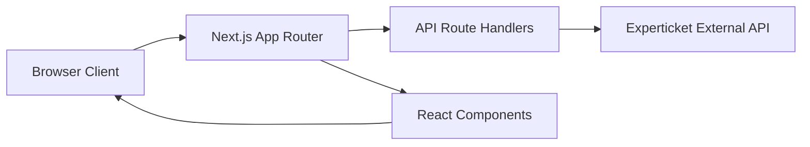

# Experticket Sales Manager

A modern web application for managing Experticket ticketing sales, transactions, and cancellations. [1](#0-0)

## Project Overview

Experticket Sales Manager is a comprehensive front-end application that interfaces with the Experticket API to provide a complete ticketing sales workflow. The application enables operators to create new sales through a guided multi-step process, manage existing transactions, handle cancellations, generate documents, and retrieve access codes.

The application serves as a proxy layer between users and the Experticket external API, providing a user-friendly interface while maintaining secure server-side API communication.

## Solution Architecture

The application follows a three-tier architecture:



### Architecture Components

**Client Layer**

- React 19 components with TypeScript
- SWR for client-side data fetching
- Form validation using React Hook Form and Zod
- Radix UI primitives for accessible components [2](#0-1)

**Server Layer**

- Next.js API routes proxy all Experticket API calls
- Server-side client handles authentication and request construction
- Environment-based configuration for security [3](#0-2)

**Type Safety**

- Comprehensive TypeScript definitions for all API requests and responses
- Shared types between client and server ensure consistency [4](#0-3)

## Core Features

### Multi-Step Sale Wizard

A guided 6-step process for creating new ticket sales:

1. **Selection** - Choose provider, products, and access date
2. **Capacity** - Verify availability for selected date
3. **Pricing** - Calculate real-time prices
4. **Questions** - Collect required ticket information
5. **Reservation** - Create temporary reservation
6. **Transaction** - Finalize the sale [5](#0-4)

### Transaction Management

- Search transactions by ID or date range
- View detailed transaction information
- Access transaction documents and codes
- Initiate cancellations [6](#0-5)

### Access Code Retrieval

Query and display access codes for completed transactions, including ticket-level codes and delivery status. [7](#0-6)

### Document Generation

Retrieve transaction documents in multiple languages, including PDF tickets and invoices. [8](#0-7)

### Cancellation Management

- Create cancellation requests with reason codes
- Check cancellation eligibility
- View cancellation request history and status [9](#0-8)

### Configuration Interface

- Test API connectivity
- Toggle test mode for safe operations
- View environment variable status
- Session-only overrides for development [10](#0-9)

## Tech Stack

### Core Framework

- **Next.js 16.1.6** - React framework with App Router
- **React 19.2.4** - UI library
- **TypeScript 5.7.3** - Type safety [11](#0-10)

### UI Components

- **Radix UI** - Accessible component primitives
- **Tailwind CSS 4.1.9** - Utility-first styling
- **Lucide React** - Icon library
- **Sonner** - Toast notifications [12](#0-11)

### Data Fetching & Forms

- **SWR 2.3.3** - React Hooks for data fetching
- **React Hook Form 7.54.1** - Form state management
- **Zod 3.24.1** - Schema validation [13](#0-12)

### Additional Libraries

- **date-fns** - Date manipulation
- **recharts** - Data visualization
- **Vercel Analytics** - Performance monitoring

## Project Structure

````
experticket-sales-app/
├── app/
│   ├── (dashboard)/           # Authenticated routes group
│   │   ├── sale/             # Multi-step sale wizard
│   │   ├── transactions/     # Transaction search and details
│   │   ├── documents/        # Document retrieval interface
│   │   ├── codes/            # Access code lookup
│   │   ├── cancellations/    # Cancellation management
│   │   └── config/           # Configuration and settings
│   ├── api/
│   │   └── experticket/      # Proxy API routes
│   │       ├── catalog/      # Product catalog endpoint
│   │       ├── transaction/  # Transaction CRUD
│   │       ├── reservation/  # Reservation creation/deletion
│   │       ├── cancellation/ # Cancellation requests
│   │       ├── documents/    # Document retrieval
│   │       ├── accesscodes/  # Access code queries
│   │       ├── capacity/     # Availability checks
│   │       ├── prices/       # Real-time pricing
│   │       ├── questions/    # Ticket questions
│   │       ├── languages/    # Supported languages
│   │       ├── tags/         # Product tags
│   │       └── lastupdated/  # System status
│   ├── layout.tsx            # Root layout with metadata
│   ├── page.tsx              # Home page (redirects to /sale)
│   └── globals.css           # Global styles
├── components/
│   ├── ui/                   # Reusable UI components
│   ├── app-shell.tsx         # Navigation shell
│   └── theme-provider.tsx    # Theme context
├── lib/
│   ├── experticket/
│   │   ├── types.ts          # TypeScript type definitions
│   │   ├── client.ts         # Client-side helpers
│   │   └── server-client.ts  # Server-side API client
│   └── utils.ts              # Utility functions
└── package.json              # Dependencies and scripts
``` [14](#0-13) [15](#0-14)

## Installation

### Prerequisites

- Node.js 18.x or higher
- npm, yarn, or pnpm package manager
- Experticket API credentials

### Setup

```bash
# Clone the repository
git clone <repository-url>
cd experticket-sales-app

# Install dependencies
npm install

# Create environment file
cp .env.example .env.local

# Configure environment variables (see next section)
````

## Configuration

### Environment Variables

Create a `.env.local` file in the project root with the following variables:

````env
EXPERTICKET_BASE_URL=https://api.experticket.com
EXPERTICKET_PARTNER_ID=your_partner_id
EXPERTICKET_API_KEY=your_api_key
EXPERTICKET_DEFAULT_LANGUAGE=en
``` [16](#0-15)

#### Variable Descriptions

- **EXPERTICKET_BASE_URL** - Base URL for the Experticket API endpoint
- **EXPERTICKET_PARTNER_ID** - Your unique partner identifier
- **EXPERTICKET_API_KEY** - API authentication key
- **EXPERTICKET_DEFAULT_LANGUAGE** - Default language code (e.g., "en", "es") [17](#0-16)

### Test Mode

The application supports a test mode flag that can be toggled in the Configuration page. When enabled, API requests include `IsTest=true` to prevent real transactions. [18](#0-17)

## Usage

### Development

```bash
npm run dev
````

The application will be available at `http://localhost:3000` [19](#0-18)

### Production Build

````bash
npm run build
npm start
``` [20](#0-19)

### Linting

```bash
npm run lint
``` [21](#0-20)

### Creating a New Sale

1. Navigate to the **New Sale** section
2. Select a language and provider
3. Choose products and set access date
4. Verify capacity availability
5. Review real-time pricing
6. Answer any required questions
7. Create reservation (temporary hold)
8. Finalize transaction [22](#0-21)

### Managing Transactions

1. Go to **Transactions** section
2. Enter transaction ID or apply filters
3. View transaction details
4. Download documents or access codes
5. Initiate cancellations if needed

### Checking Configuration

1. Navigate to **Configuration**
2. Click **Check Connection** to verify API connectivity
3. Review environment variable status
4. Toggle test mode as needed

## API Documentation

All API routes are server-side proxies to the Experticket external API. They handle authentication, error handling, and response formatting.

### Catalog

**GET** `/api/experticket/catalog`

Retrieves the product catalog including providers, products, tickets, and sessions.

**Query Parameters:**
- `LanguageCode` (optional) - Language code for localized content

**Response:** `CatalogResponse` [23](#0-22)

### Transactions

**GET** `/api/experticket/transaction`

Lists or searches for transactions.

**Query Parameters:**
- `SaleId` - Filter by sale ID
- `ReservationId` - Filter by reservation ID
- `FromTransactionDateTime` - Start date filter
- `ToTransactionDateTime` - End date filter
- `PageSize` - Results per page (default: 20)
- `Page` - Page number (default: 1)

**Response:** `TransactionListResponse` [24](#0-23)

**POST** `/api/experticket/transaction`

Creates a new transaction from an existing reservation.

**Request Body:** `TransactionCreateRequest` [25](#0-24)

### Reservation

**POST** `/api/experticket/reservation`

Creates a temporary reservation for products.

**Request Body:** `ReservationRequest`

**Response:** `ReservationResponse` [26](#0-25)

**DELETE** `/api/experticket/reservation`

Cancels an existing reservation.

**Request Body:** Contains `ReservationId` [27](#0-26)

### Cancellation

**GET** `/api/experticket/cancellation`

Lists cancellation requests.

**Query Parameters:**
- `SaleId` - Filter by sale ID
- `Status` - Filter by status
- `PageSize` - Results per page
- `Page` - Page number

**Response:** `CancellationListResponse` [28](#0-27)

**POST** `/api/experticket/cancellation`

Creates a cancellation request or checks cancellation status.

**Request Body:**
- `action` - "check" or default (create)
- `saleId` - Sale to cancel
- `reason` - Reason code
- `reasonComments` - Additional comments

**Response:** `CancellationRequestResponse` or `CancellationListResponse` [29](#0-28)

### Documents

**GET** `/api/experticket/documents`

Retrieves transaction documents (tickets, invoices).

**Query Parameters:**
- `id` - Transaction ID
- `IncludeTransactionDocumentsLanguages` - Include language variants (default: true)

**Response:** `TransactionDocumentsResponse` [8](#0-7)

### Access Codes

**GET** `/api/experticket/accesscodes`

Retrieves access codes for transaction tickets.

**Query Parameters:**
- `SaleId` - Transaction sale ID
- `InternalCodes` - Filter by internal codes (optional)

**Response:** `AccessCodesResponse` [7](#0-6)

### Additional Endpoints

The API also includes routes for:
- `/api/experticket/capacity` - Check available capacity
- `/api/experticket/prices` - Get real-time prices
- `/api/experticket/questions` - Retrieve ticket questions
- `/api/experticket/languages` - List supported languages
- `/api/experticket/tags` - Get product tags
- `/api/experticket/lastupdated` - Check system status

## Architecture Decisions

### Server-Side API Proxy Pattern

All external API calls are made from Next.js API routes rather than directly from the browser. This approach provides:

- **Security** - API keys never exposed to the client
- **Error Handling** - Consistent error responses across all endpoints
- **Timeout Management** - Configurable request timeouts
- **Retry Logic** - Automatic retries for idempotent GET requests [30](#0-29)

### Type-Safe API Integration

The application maintains comprehensive TypeScript definitions for all API requests and responses, ensuring type safety across the entire stack. [31](#0-30)

### State Management in Sale Wizard

The multi-step sale wizard uses centralized React state management to maintain data consistency across all steps, avoiding prop drilling and enabling easy step navigation. [32](#0-31)

### Component Architecture

The application uses:
- **Radix UI primitives** for accessibility and keyboard navigation
- **Compound components** for complex UI patterns
- **Client-side data fetching** with SWR for caching and revalidation [33](#0-32)

### Responsive Navigation

The AppShell component implements a mobile-first navigation system with a collapsible drawer for small screens and a horizontal nav bar for larger displays. [34](#0-33)

## Notes

- The application defaults to the `/sale` route for immediate access to the primary workflow
- All monetary values are handled as numbers with appropriate formatting applied in the UI
- Date/time values follow ISO 8601 format for consistency with the Experticket API
- Error responses follow a consistent format with `Success: false` and descriptive `ErrorMessage`
- The application supports Vercel Analytics for performance monitoring in production

### Citations

**File:** app/layout.tsx (L11-12)
```typescript
  title: "Experticket Sales Manager",
  description: "Manage Experticket ticketing sales, transactions, and cancellations",
````

**File:** lib/experticket/client.ts (L1-17)

````typescript
/**
 * @module experticket-client
 * @description Client-side helpers for calling internal Experticket proxy API routes.
 */

/**
 * A simple fetcher compatible with the SWR library for data fetching.
 *
 * @param url - The URL to fetch data from.
 * @returns A promise that resolves to the parsed JSON response.
 *
 * @example
 * ```typescript
 * const { data, error } = useSWR('/api/experticket/catalog', fetcher);
 * ```
 */
export const fetcher = (url: string) => fetch(url).then((r) => r.json());
````

**File:** lib/experticket/server-client.ts (L1-13)

```typescript
/**
 * @module experticket-server-client
 * @description Server-side Experticket API client for communicating directly with the Experticket external API.
 *
 * @remarks
 * This module should ONLY be imported from API route handlers or server-side functions.
 * It uses environment variables for configuration.
 */

const BASE_URL = process.env.EXPERTICKET_BASE_URL || "";
const PARTNER_ID = process.env.EXPERTICKET_PARTNER_ID || "";
const API_KEY = process.env.EXPERTICKET_API_KEY || "";
const DEFAULT_LANG = process.env.EXPERTICKET_DEFAULT_LANGUAGE || "en";
```

**File:** lib/experticket/server-client.ts (L64-79)

````typescript
 * Performs a server-side fetch to the Experticket API.
 * Handles URL building, timeouts, retries (for GET), and JSON parsing.
 *
 * @param path - The API endpoint path relative to the BASE_URL.
 * @param options - Configuration for the request (method, body, params, etc.).
 * @returns A promise that resolves to the parsed JSON response of type T.
 *
 * @throws {Error} If the API response is not OK or if a network/timeout error occurs.
 *
 * @example
 * ```typescript
 * const catalog = await experticketFetch<CatalogResponse>('catalog', {
 *   params: { LanguageCode: 'en' }
 * });
 * ```
 */
````

**File:** lib/experticket/types.ts (L1-4)

```typescript
/**
 * @module experticket-types
 * @description Type definitions for the Experticket API requests and responses.
 */
```

**File:** lib/experticket/types.ts (L8-22)

```typescript
/**
 * Base response shape shared by all Experticket API responses.
 */
export interface ExperticketBaseResponse {
  /** Indicates if the request was successful. */
  Success: boolean;
  /** ISO timestamp of the response. */
  Timestamp?: string;
  /** Human-readable error message if Success is false. */
  ErrorMessage?: string | null;
  /** List of error codes. */
  ErrorCodes?: string[];
  /** Detailed breakdown of errors by entity. */
  ErrorEntityBreakDown?: { Id: string; Name: string }[];
}
```

**File:** app/(dashboard)/sale/page.tsx (L27-64)

```typescript
 * Shared state for the entire sale wizard.
 */
export interface SaleState {
  /** Selected language code for the sale. */
  language: string
  /** The provider selected in Step 1. */
  provider: CatalogProvider | null
  /** List of products added to the cart, including their quantities. */
  selectedProducts: (CatalogProduct & { quantity: number })[]
  /** Chosen access date for the sale. */
  accessDate: string
  /** Optional end date for access. */
  accessEndDate?: string
  /** Optional session identifier. */
  sessionId?: string

  // Step 2
  /** Capacity data fetched for the selected products and date. */
  capacityData: CapacityItem[]

  // Step 3
  /** Real-time pricing information. */
  pricingData: RealTimePriceItem[]

  // Step 4
  /** Answers provided for the required ticket questions. */
  questionAnswers: Record<string, unknown>

  // Step 5
  /** The reservation result from the Experticket API. */
  reservation: ReservationResponse | null
  /** Timestamp indicating when the current reservation expires. */
  reservationExpiry: number | null

  // Step 6
  /** The final transaction details after successful creation. */
  transaction: Transaction | null
}
```

**File:** app/(dashboard)/sale/page.tsx (L69-76)

```typescript
const STEPS = [
  "Selection",
  "Capacity",
  "Pricing",
  "Questions",
  "Reservation",
  "Transaction",
] as const;
```

**File:** app/(dashboard)/sale/page.tsx (L79-86)

```typescript
 * SalePage component that manages the state and navigation of the sale wizard.
 *
 * @remarks
 * - Implements a 6-step wizard: Selection → Capacity → Pricing → Questions → Reservation → Transaction.
 * - Centralizes the sale state to ensure data consistency across steps.
 * - Provides helper functions for navigation (`goNext`, `goBack`, `goTo`) and state updates.
 */
export default function SalePage() {
```

**File:** app/(dashboard)/transactions/page.tsx (L17-26)

```typescript
export default function TransactionsPage() {
  const [searchId, setSearchId] = useState("")
  const [searchedId, setSearchedId] = useState<string | null>(null)
  const [selectedTx, setSelectedTx] = useState<Record<string, unknown> | null>(null)
  const [error, setError] = useState<string | null>(null)

  const { data: txData, isLoading } = useSWR(
    searchedId ? `/api/experticket/transaction?SaleId=${encodeURIComponent(searchedId)}` : null,
    fetcher
  )
```

**File:** app/api/experticket/accesscodes/route.ts (L5-20)

```typescript
export async function GET(request: NextRequest) {
  try {
    const sp = request.nextUrl.searchParams
    const data = await experticketFetch<AccessCodesResponse>("/transactionaccesscodes", {
      params: {
        ApiKey: getEncodedApiKey(),
        SaleId: sp.get("SaleId") || "",
        InternalCodes: sp.get("InternalCodes") || undefined,
      },
      retries: 1,
    })
    return NextResponse.json(data)
  } catch (err: unknown) {
    const message = err instanceof Error ? err.message : "Unknown error"
    return NextResponse.json({ Success: false, ErrorMessage: message }, { status: 502 })
  }
```

**File:** app/api/experticket/documents/route.ts (L5-20)

```typescript
export async function GET(request: NextRequest) {
  try {
    const sp = request.nextUrl.searchParams
    const data = await experticketFetch<TransactionDocumentsResponse>("/transactiondocuments", {
      params: {
        ApiKey: getEncodedApiKey(),
        id: sp.get("id") || "",
        IncludeTransactionDocumentsLanguages: sp.get("IncludeTransactionDocumentsLanguages") || "true",
      },
      retries: 1,
    })
    return NextResponse.json(data)
  } catch (err: unknown) {
    const message = err instanceof Error ? err.message : "Unknown error"
    return NextResponse.json({ Success: false, ErrorMessage: message }, { status: 502 })
  }
```

**File:** app/api/experticket/cancellation/route.ts (L9-45)

```typescript
export async function POST(request: NextRequest) {
  try {
    const body = await request.json()
    const { action, saleId, reason, reasonComments, ...rest } = body

    if (action === "check") {
      // Check cancellation status by listing cancellation requests for this sale
      const data = await experticketFetch<CancellationListResponse>("/cancellationrequest", {
        params: {
          ApiKey: getEncodedApiKey(),
          SaleId: saleId,
          PageSize: "10",
          Page: "1",
        },
        retries: 1,
      })
      return NextResponse.json(data)
    }

    // Default: create a cancellation request
    const payload = {
      ApiKey: getRawApiKey(),
      SaleId: saleId,
      Reason: reason ?? 0,
      ReasonComments: reasonComments || undefined,
      ...rest,
    }

    const data = await experticketFetch<CancellationRequestResponse>("/cancellationrequest", {
      method: "POST",
      body: payload,
    })
    return NextResponse.json(data)
  } catch (err: unknown) {
    const message = err instanceof Error ? err.message : "Unknown error"
    return NextResponse.json({ Success: false, ErrorMessage: message }, { status: 502 })
  }
```

**File:** app/api/experticket/cancellation/route.ts (L48-69)

```typescript
export async function GET(request: NextRequest) {
  try {
    const sp = request.nextUrl.searchParams
    const data = await experticketFetch<CancellationListResponse>("/cancellationrequest", {
      params: {
        ApiKey: getEncodedApiKey(),
        SaleId: sp.get("SaleId") || undefined,
        FromCreatedDateTime: sp.get("FromCreatedDateTime") || undefined,
        ToCreatedDateTime: sp.get("ToCreatedDateTime") || undefined,
        FromUpdatedDateTime: sp.get("FromUpdatedDateTime") || undefined,
        ToUpdatedDateTime: sp.get("ToUpdatedDateTime") || undefined,
        Status: sp.get("Status") || undefined,
        PageSize: sp.get("PageSize") || "20",
        Page: sp.get("Page") || "1",
      },
      retries: 1,
    })
    return NextResponse.json(data)
  } catch (err: unknown) {
    const message = err instanceof Error ? err.message : "Unknown error"
    return NextResponse.json({ Success: false, ErrorMessage: message }, { status: 502 })
  }
```

**File:** app/(dashboard)/config/page.tsx (L14-24)

```typescript
export default function ConfigPage() {
  const [isTest, setIsTest] = useState(false)
  const [localPartnerId, setLocalPartnerId] = useState("")
  const [localLanguage, setLocalLanguage] = useState("en")
  const [advancedMode, setAdvancedMode] = useState(false)
  const [checking, setChecking] = useState(false)
  const [connectionResult, setConnectionResult] = useState<{
    success: boolean
    message: string
    timestamp?: string
  } | null>(null)
```

**File:** app/(dashboard)/config/page.tsx (L76-82)

```typescript
          <div className="flex flex-wrap items-center gap-3">
            <Badge variant="secondary">EXPERTICKET_BASE_URL</Badge>
            <Badge variant="secondary">EXPERTICKET_PARTNER_ID</Badge>
            <Badge variant="secondary">EXPERTICKET_API_KEY</Badge>
            <span className="text-sm text-muted-foreground">
              Set via environment variables
            </span>
```

**File:** app/(dashboard)/config/page.tsx (L123-147)

```typescript
      <Card>
        <CardHeader>
          <CardTitle>Test Mode</CardTitle>
          <CardDescription>
            When enabled, API calls include IsTest=true. No real actions are performed.
          </CardDescription>
        </CardHeader>
        <CardContent>
          <div className="flex items-center gap-3">
            <Switch
              id="is-test"
              checked={isTest}
              onCheckedChange={(val) => {
                setIsTest(val)
                if (typeof window !== "undefined") {
                  localStorage.setItem("experticket_is_test", String(val))
                }
                toast.info(val ? "Test mode enabled" : "Test mode disabled")
              }}
            />
            <Label htmlFor="is-test" className="cursor-pointer">
              {isTest ? "Test Mode ON" : "Test Mode OFF"}
            </Label>
          </div>
        </CardContent>
```

**File:** package.json (L6-6)

```json
    "dev": "next dev",
```

**File:** package.json (L7-8)

```json
    "build": "next build",
    "start": "next start",
```

**File:** package.json (L9-9)

```json
    "lint": "eslint ."
```

**File:** package.json (L17-43)

```json
    "@radix-ui/react-accordion": "1.2.12",
    "@radix-ui/react-alert-dialog": "1.1.15",
    "@radix-ui/react-aspect-ratio": "1.1.8",
    "@radix-ui/react-avatar": "1.1.11",
    "@radix-ui/react-checkbox": "1.3.3",
    "@radix-ui/react-collapsible": "1.1.12",
    "@radix-ui/react-context-menu": "2.2.16",
    "@radix-ui/react-dialog": "1.1.15",
    "@radix-ui/react-dropdown-menu": "2.1.16",
    "@radix-ui/react-hover-card": "1.1.15",
    "@radix-ui/react-label": "2.1.8",
    "@radix-ui/react-menubar": "1.1.16",
    "@radix-ui/react-navigation-menu": "1.2.14",
    "@radix-ui/react-popover": "1.1.15",
    "@radix-ui/react-progress": "1.1.8",
    "@radix-ui/react-radio-group": "1.3.8",
    "@radix-ui/react-scroll-area": "1.2.10",
    "@radix-ui/react-select": "2.2.6",
    "@radix-ui/react-separator": "1.1.8",
    "@radix-ui/react-slider": "1.3.6",
    "@radix-ui/react-slot": "1.2.4",
    "@radix-ui/react-switch": "1.2.6",
    "@radix-ui/react-tabs": "1.1.13",
    "@radix-ui/react-toast": "1.2.15",
    "@radix-ui/react-toggle": "1.1.10",
    "@radix-ui/react-toggle-group": "1.1.11",
    "@radix-ui/react-tooltip": "1.2.8",
```

**File:** package.json (L54-58)

```json
    "next": "16.1.6",
    "next-themes": "^0.4.6",
    "react": "19.2.4",
    "react-day-picker": "9.13.2",
    "react-dom": "19.2.4",
```

**File:** package.json (L59-67)

```json
    "react-hook-form": "^7.54.1",
    "react-resizable-panels": "^2.1.7",
    "recharts": "2.15.0",
    "sonner": "^1.7.1",
    "swr": "^2.3.3",
    "tailwind-merge": "^3.3.1",
    "typescript-eslint": "^8.56.0",
    "vaul": "^1.1.2",
    "zod": "^3.24.1"
```

**File:** app/(dashboard)/layout.tsx (L1-5)

```typescript
import { AppShell } from "@/components/app-shell";

export default function DashboardLayout({
  children,
}: {
  children: React.ReactNode;
}) {
  return <AppShell>{children}</AppShell>;
}
```

**File:** components/app-shell.tsx (L1-46)

```typescript
/**
 * @module AppShell
 * @description The main layout wrapper for the application, providing navigation and a responsive container.
 */

"use client";

import Link from "next/link";
import { usePathname } from "next/navigation";
import {
  ShoppingCart,
  List,
  FileText,
  QrCode,
  XCircle,
  Settings,
  Ticket,
  Menu,
  X,
} from "lucide-react";
import { cn } from "@/lib/utils";
import { useState } from "react";

/**
 * Navigation item configuration.
 */
const navItems = [
  { href: "/sale", label: "New Sale", icon: ShoppingCart },
  { href: "/transactions", label: "Transactions", icon: List },
  { href: "/documents", label: "Documents", icon: FileText },
  { href: "/codes", label: "Access Codes", icon: QrCode },
  { href: "/cancellations", label: "Cancellations", icon: XCircle },
  { href: "/config", label: "Configuration", icon: Settings },
];

/**
 * AppShell component that renders the top navigation bar and a mobile drawer.
 *
 * @param props - Contains the `children` to be rendered within the main content area.
 * @param props.children - The content of the page.
 *
 * @remarks
 * - It uses a sticky header and a responsive navigation system.
 * - Mobile navigation is handled via a state-controlled drawer.
 * - Active links are highlighted based on the current pathname.
 */
```

**File:** components/app-shell.tsx (L47-88)

```typescript
export function AppShell({ children }: { children: React.ReactNode }) {
  const pathname = usePathname()
  const [mobileOpen, setMobileOpen] = useState(false)

  return (
    <div className="flex min-h-screen flex-col">
      {/* Top bar */}
      <header className="sticky top-0 z-40 flex h-14 items-center gap-4 border-b border-border bg-background px-4 lg:px-6">
        <button
          className="lg:hidden"
          onClick={() => setMobileOpen(!mobileOpen)}
          aria-label="Toggle navigation"
        >
          {mobileOpen ? <X className="h-5 w-5" /> : <Menu className="h-5 w-5" />}
        </button>
        <Link href="/" className="flex items-center gap-2">
          <Ticket className="h-6 w-6 text-primary" />
          <span className="text-lg font-semibold tracking-tight">Experticket</span>
        </Link>
        <nav className="ml-auto hidden items-center gap-1 lg:flex">
          {navItems.map((item) => {
            const Icon = item.icon
            const active = pathname.startsWith(item.href)
            return (
              <Link
                key={item.href}
                href={item.href}
                className={cn(
                  "flex items-center gap-2 rounded-md px-3 py-2 text-sm font-medium transition-colors",
                  active
                    ? "bg-primary text-primary-foreground"
                    : "text-muted-foreground hover:bg-accent hover:text-accent-foreground"
                )}
              >
                <Icon className="h-4 w-4" />
                {item.label}
              </Link>
            )
          })}
        </nav>
      </header>

```

**File:** app/api/experticket/catalog/route.ts (L9-25)

```typescript
export async function GET(request: NextRequest) {
  try {
    const sp = request.nextUrl.searchParams
    const lang = sp.get("LanguageCode") || getDefaultLanguage()

    const data = await experticketFetch<CatalogResponse>("/catalog", {
      params: {
        PartnerId: getPartnerId(),
        LanguageCode: lang,
      },
      retries: 1,
    })
    return NextResponse.json(data)
  } catch (err: unknown) {
    const message = err instanceof Error ? err.message : "Unknown error"
    return NextResponse.json({ Success: false, ErrorMessage: message }, { status: 502 })
  }
```

**File:** app/api/experticket/transaction/route.ts (L9-25)

```typescript
export async function POST(request: NextRequest) {
  try {
    const body = await request.json()
    const payload = {
      ...body,
      ApiKey: getRawApiKey(),
    }

    const data = await experticketFetch("/transaction", {
      method: "POST",
      body: payload,
    })
    return NextResponse.json(data)
  } catch (err: unknown) {
    const message = err instanceof Error ? err.message : "Unknown error"
    return NextResponse.json({ Success: false, ErrorMessage: message }, { status: 502 })
  }
```

**File:** app/api/experticket/transaction/route.ts (L28-56)

```typescript
export async function GET(request: NextRequest) {
  try {
    const sp = request.nextUrl.searchParams
    const params: Record<string, string | undefined> = {
      ApiKey: getEncodedApiKey(),
      SaleId: sp.get("SaleId") || undefined,
      ReservationId: sp.get("ReservationId") || undefined,
      PartnerSaleId: sp.get("PartnerSaleId") || undefined,
      PointOfSaleId: sp.get("PointOfSaleId") || undefined,
      FromTransactionDateTime: sp.get("FromTransactionDateTime") || undefined,
      ToTransactionDateTime: sp.get("ToTransactionDateTime") || undefined,
      FromAccessDateTime: sp.get("FromAccessDateTime") || undefined,
      ToAccessDateTime: sp.get("ToAccessDateTime") || undefined,
      FromCancelledDateTime: sp.get("FromCancelledDateTime") || undefined,
      ToCancelledDateTime: sp.get("ToCancelledDateTime") || undefined,
      PageSize: sp.get("PageSize") || "20",
      Page: sp.get("Page") || "1",
      LanguageCode: sp.get("LanguageCode") || undefined,
    }

    const data = await experticketFetch<TransactionListResponse>("/transaction", {
      params,
      retries: 1,
    })
    return NextResponse.json(data)
  } catch (err: unknown) {
    const message = err instanceof Error ? err.message : "Unknown error"
    return NextResponse.json({ Success: false, ErrorMessage: message }, { status: 502 })
  }
```

**File:** app/api/experticket/reservation/route.ts (L8-25)

```typescript
export async function POST(request: NextRequest) {
  try {
    const body = await request.json();
    const payload = {
      ...body,
      ApiKey: getRawApiKey(),
    };

    const data = await experticketFetch<ReservationResponse>("/reservation", {
      method: "POST",
      body: payload,
    });
    return NextResponse.json(data);
  } catch (err: unknown) {
    const message = err instanceof Error ? err.message : "Unknown error";
    return NextResponse.json(
      { Success: false, ErrorMessage: message },
      { status: 502 }
    );
  }
}
```

**File:** app/api/experticket/reservation/route.ts (L27-44)

```typescript
export async function DELETE(request: NextRequest) {
  try {
    const body = await request.json();
    const payload = {
      ...body,
      ApiKey: getRawApiKey(),
    };

    const data = await experticketFetch("/reservation", {
      method: "DELETE",
      body: payload,
    });
    return NextResponse.json(data);
  } catch (err: unknown) {
    const message = err instanceof Error ? err.message : "Unknown error";
    return NextResponse.json(
      { Success: false, ErrorMessage: message },
      { status: 502 }
    );
  }
}
```
