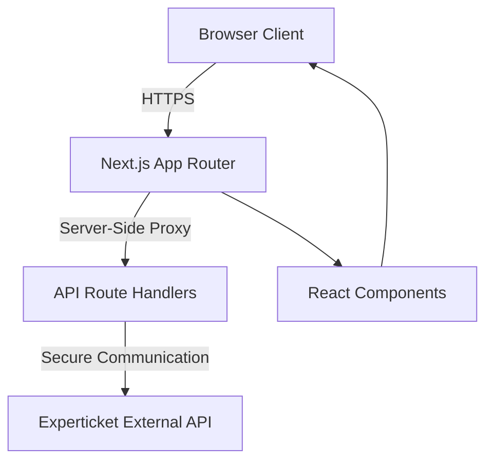

# Experticket Sales Manager[](https://opensource.org/licenses/MIT)
[](https://www.typescriptlang.org/)
[](https://nextjs.org/)
[](https://reactjs.org/)

A modern, secure web application for managing Experticket ticketing sales, transactions, and cancellations with a guided multi-step workflow.


## 📋 Table of Contents
- [Overview](#overview)
- [Key Features](#key-features)
- [Architecture](#architecture)
- [Tech Stack](#tech-stack)
- [Project Structure](#project-structure)
- [Installation](#installation)
- [Configuration](#configuration)
- [Usage](#usage)
- [API Documentation](#api-documentation)
- [Development](#development)
- [Deployment](#deployment)
- [Troubleshooting](#troubleshooting)
- [Contributing](#contributing)
- [License](#license)

## 🎯 Overview

Experticket Sales Manager streamlines the ticketing sales process by providing a user-friendly interface that interfaces with the Experticket API. The application enables operators to:

- Create new ticket sales through an intuitive 6-step wizard
- Manage existing transactions and access detailed information
- Handle cancellations and retrieve access codes
- Generate documents in multiple languages
- Test API connectivity in a safe environment

Built with security as a priority, all API communications are proxied through Next.js API routes, ensuring that sensitive credentials never reach the client browser.

## ⭐ Key Features

### 🎫 Multi-Step Sale Wizard
A guided 6-step process for creating new ticket sales:
1. **Selection** - Choose provider, products, and access date
2. **Capacity** - Verify availability for selected date
3. **Pricing** - Calculate real-time prices
4. **Questions** - Collect required ticket information
5. **Reservation** - Create temporary reservation
6. **Transaction** - Finalize the sale

### 📊 Transaction Management
- Search transactions by ID, date range, or other filters
- View detailed transaction information with audit trails
- Access and download transaction documents
- Retrieve access codes for completed transactions

### 🔄 Cancellation Management
- Create cancellation requests with reason codes
- Check cancellation eligibility before processing
- View cancellation request history and status
- Process full or partial cancellations

### ⚙️ Configuration Interface
- Test API connectivity with real-time feedback
- Toggle test mode for safe development operations
- View and override environment variables (session-only)
- Monitor system status and last update times

### 📄 Document Generation
- Retrieve transaction documents (tickets, invoices) in multiple languages
- Support for PDF generation and download
- Language variant inclusion/exclusion options

## 🏗️ Architecture

Experticket Sales Manager follows a secure three-tier architecture that separates concerns while maintaining simplicity:



### Security First Approach
- **API Key Protection**: All Experticket API keys remain server-side, never exposed to clients
- **Request Proxying**: All external API calls route through Next.js API routes
- **Environment Isolation**: Configuration managed through environment variables
- **Input Validation**: Comprehensive validation using Zod schemas on both client and server

### Data Flow
1. User interacts with React components in the browser
2. Components use SWR to fetch data from internal API routes (`/api/experticket/*`)
3. API routes communicate with Experticket API using server-side credentials
4. Responses are formatted and returned to the client
5. State is managed centrally for complex workflows (like the sale wizard)

## 💻 Tech Stack

### Core Framework
- **Next.js 16.1.6** - React framework with App Router for hybrid rendering
- **React 19.2.4** - Modern UI library with concurrent features
- **TypeScript 5.7.3** - Strict type safety throughout the codebase

### UI & Styling
- **Radix UI** - Accessible, unstyled component primitives
- **Tailwind CSS 4.1.9** - Utility-first CSS framework
- **Lucide React** - Beautiful, consistent icon set
- **Sonner** - Opinionated toast notifications

### Data Management
- **SWR 2.3.3** - React Hooks for data fetching with caching and revalidation
- **React Hook Form 7.54.1** - Performant form state management
- **Zod 3.24.1** - TypeScript-first schema validation

### Utilities
- **date-fns 4.1.0** - Modern date manipulation library
- **Recharts 2.15.0** - Composing charting library built on React
- **Vercel Analytics** - Performance monitoring and insights

## 📁 Project Structure

```
experticket-sales-app/
├── app/
│   ├── (dashboard)/           # Authenticated routes group
│   │   ├── sale/             # Multi-step sale wizard (6 steps)
│   │   │   ├── selection/    # Step 1: Product selection
│   │   │   ├── capacity/     # Step 2: Availability check
│   │   │   ├── pricing/      # Step 3: Price calculation
│   │   │   ├── questions/    # Step 4: Ticket information
│   │   │   ├── reservation/  # Step 5: Temporary hold
│   │   │   └── transaction/  # Step 6: Finalize sale
│   │   ├── transactions/     # Transaction search and details
│   │   ├── documents/        # Document retrieval interface
│   │   ├── codes/            # Access code lookup
│   │   ├── cancellations/    # Cancellation management
│   │   └── config/           # Configuration and settings
│   ├── api/
│   │   └── experticket/      # Proxy API routes to Experticket
│   │       ├── catalog/      # Product catalog endpoint
│   │       ├── transaction/  # Transaction CRUD operations
│   │       ├── reservation/  # Reservation creation/deletion
│   │       ├── cancellation/ # Cancellation requests
│   │       ├── documents/    # Document retrieval
│   │       ├── accesscodes/  # Access code queries
│   │       ├── capacity/     # Availability checks
│   │       ├── prices/       # Real-time pricing
│   │       ├── questions/    # Ticket questions
│   │       ├── languages/    # Supported languages
│   │       ├── tags/         # Product tags
│   │       └── lastupdated/  # System status
│   ├── layout.tsx            # Root layout with metadata and providers
│   ├── page.tsx              # Home page (redirects to /sale)
│   └── globals.css           # Global styles and Tailwind directives
├── components/
│   ├── ui/                   # Reusable UI components (Radix-based)
│   ├── app-shell.tsx         # Navigation shell with responsive drawer
│   └── theme-provider.tsx    # Theme context provider
├── lib/
│   ├── experticket/
│   │   ├── types.ts          # TypeScript definitions for API
│   │   ├── client.ts         # Client-side SWR fetcher helpers
│   │   └── server-client.ts  # Server-side API client with retries
│   └── utils.ts              # Utility functions (formatters, helpers)
├── public/                   # Static assets
├── scripts/                  # Utility scripts
└── package.json              # Dependencies and scripts
```

## 🚀 Installation

### Prerequisites
- Node.js 18.x or higher
- npm, yarn, or pnpm package manager
- Experticket API credentials (Partner ID and API Key)

### Quick Start

```bash
# Clone the repository
git clone https://github.com/your-org/experticket-sales-app.git
cd experticket-sales-app

# Install dependencies
npm install

# Create environment file
cp .env.example .env.local

# Configure your Experticket credentials in .env.local
# EXPERTICKET_BASE_URL=https://api.experticket.com
# EXPERTICKET_PARTNER_ID=your_partner_id
# EXPERTICKET_API_KEY=your_api_key
# EXPERTICKET_DEFAULT_LANGUAGE=en

# Start development server
npm run dev
```

The application will be available at [http://localhost:3000](http://localhost:3000)

## 🔧 Configuration

### Environment Variables

Create a `.env.local` file in the project root with the following variables:

| Variable | Description | Example |
|----------|-------------|---------|
| `EXPERTICKET_BASE_URL` | Base URL for Experticket API | `https://api.experticket.com` |
| `EXPERTICKET_PARTNER_ID` | Your unique partner identifier | `partner_12345` |
| `EXPERTICKET_API_KEY` | API authentication key | `your_secret_api_key` |
| `EXPERTICKET_DEFAULT_LANGUAGE` | Default language code | `en` |
| `NEXT_PUBLIC_API_MOCKING` | Enable API mocking (development) | `disabled` |

> **Security Note**: Never commit `.env.local` to version control. The `.env.example` file shows the required structure without exposing actual values.

### Test Mode
The application includes a test mode that prevents real transactions:
1. Navigate to the Configuration page
2. Toggle "Test Mode ON"
3. When enabled, all API requests include `IsTest=true`
4. No real transactions are created or modified

## 💡 Usage

### Creating a New Sale
1. Click "New Sale" in the navigation or visit `/sale`
2. **Step 1 - Selection**: Choose language, provider, products, and access date
3. **Step 2 - Capacity**: Verify availability for selected date and products
4. **Step 3 - Pricing**: Review real-time pricing calculations
5. **Step 4 - Questions**: Answer any required ticket-specific questions
6. **Step 5 - Reservation**: Create a temporary reservation (holds inventory)
7. **Step 6 - Transaction**: Finalize the sale and receive confirmation

### Managing Transactions
1. Navigate to the Transactions section (`/transactions`)
2. Search by Transaction ID, date range, or other filters
3. Select a transaction to view detailed information
4. From the detail view, you can:
   - Download tickets and invoices
   - Retrieve access codes
   - Initiate cancellation requests
   - View transaction history

### Checking API Connectivity
1. Navigate to Configuration (`/config`)
2. Click "Check Connection"
3. Review the result showing success status and timestamp
4. Verify environment variable status is displayed correctly

## 📚 API Documentation

All API routes are server-side proxies to the Experticket external API. They handle authentication, error formatting, timeout management, and retry logic.

### Base Path
All API routes are prefixed with `/api/experticket`

### Common Response Format
All API responses follow this structure:
```typescript
{
  Success: boolean;
  Timestamp?: string (ISO 8601);
  ErrorMessage?: string | null;
  ErrorCodes?: string[];
  ErrorEntityBreakDown?: { Id: string; Name: string }[];
}
```

### Endpoints

#### Catalog
- **GET** `/catalog`
  - Retrieves product catalog including providers, products, tickets, and sessions
  - Query: `LanguageCode` (optional)
  - Response: `CatalogResponse`

#### Transactions
- **GET** `/transaction`
  - Lists or searches for transactions
  - Query: `SaleId`, `ReservationId`, date filters, pagination, `LanguageCode`
  - Response: `TransactionListResponse`
- **POST** `/transaction`
  - Creates a new transaction from an existing reservation
  - Body: `TransactionCreateRequest`
  - Response: `Transaction`

#### Reservations
- **POST** `/reservation`
  - Creates a temporary reservation for products
  - Body: `ReservationRequest`
  - Response: `ReservationResponse`
- **DELETE** `/reservation`
  - Cancels an existing reservation
  - Body: `{ ReservationId: string }`

#### Cancellations
- **GET** `/cancellation`
  - Lists cancellation requests
  - Query: `SaleId`, `Status`, pagination, date filters
  - Response: `CancellationListResponse`
- **POST** `/cancellation`
  - Creates cancellation request or checks status
  - Body: `{ action: "check", saleId, reason?, reasonComments? }`
  - Response: `CancellationRequestResponse` or `CancellationListResponse`

#### Documents
- **GET** `/documents`
  - Retrieves transaction documents (tickets, invoices)
  - Query: `id`, `IncludeTransactionDocumentsLanguages`
  - Response: `TransactionDocumentsResponse`

#### Access Codes
- **GET** `/accesscodes`
  - Retrieves access codes for transaction tickets
  - Query: `SaleId`, `InternalCodes`
  - Response: `AccessCodesResponse`

#### Additional Endpoints
- `/capacity` - Check available capacity for products and dates
- `/prices` - Get real-time pricing information
- `/questions` - Retrieve ticket-specific questions
- `/languages` - List supported languages
- `/tags` - Get product tags
- `/lastupdated` - Check system status and last update time

### Error Handling
The API returns consistent error responses:
- HTTP 200 with `Success: false` for business logic errors
- HTTP 502 for upstream API or network errors
- HTTP 500 for unexpected server errors

All errors include descriptive messages in `ErrorMessage` and may include error codes.

## 🛠️ Development

### Available Scripts
```bash
# Start development server
npm run dev

# Build for production
npm run build

# Start production server
npm start

# Run linting
npm run lint

# Fix linting errors
npm run lint:fix

# Run tests
npm run test
```

### Code Quality
- ESLint with TypeScript configuration
- Prettier for code formatting
- TypeScript strict mode enabled
- Commit hooks via Husky (if configured)

### Environment Setup
1. Install Node.js 18+
2. Install dependencies with `npm install`
3. Copy `.env.example` to `.env.local`
4. Fill in your Experticket credentials
5. Run `npm run dev` to start the development server

### Adding New Features
1. Create API routes in `app/api/experticket/[endpoint]/route.ts`
2. Add TypeScript types in `lib/experticket/types.ts`
3. Create React components in the appropriate feature directory
4. Use SWR hooks for data fetching: `useSWR('/api/experticket/endpoint', fetcher)`
5. Implement form validation with React Hook Form and Zod
6. Add unit tests for new functionality

## ☁️ Deployment

### Vercel (Recommended)
1. Push repository to GitHub
2. Import project in Vercel dashboard
3. Configure environment variables in Vercel settings
4. Vercel will automatically build and deploy

### Docker
```bash
# Build Docker image
docker build -t experticket-sales-manager .

# Run container
docker run -p 3000:3000 \
  -e EXPERTICKET_BASE_URL=https://api.experticket.com \
  -e EXPERTICKET_PARTNER_ID=your_partner_id \
  -e EXPERTICKET_API_KEY=your_api_key \
  -e EXPERTICKET_DEFAULT_LANGUAGE=en \
  experticket-sales-manager
```

### Manual Deployment
1. Build the application: `npm run build`
2. Start the production server: `npm start`
3. Ensure environment variables are set in the production environment
4. Use a process manager like PM2 for production process management

## 🐛 Troubleshooting

### Common Issues

#### "API Key not configured" Error
- **Cause**: Missing or incorrect API credentials in environment variables
- **Solution**: Verify `.env.local` contains valid `EXPERTICKET_API_KEY` and restart the development server

#### CORS Errors in Browser
- **Cause**: Attempting to call Experticket API directly from client (should be proxied)
- **Solution**: Ensure all API calls go through `/api/experticket/*` routes, not direct to external API

#### Stale Data After Changes
- **Cause**: SWR cache not being invalidated
- **Solution**: Use `mutate` from SWR to manually refresh data when needed, or check revalidation settings

#### Test Mode Not Working
- **Cause**: Test mode flag not being sent with requests
- **Solution**: Verify the test mode toggle is working and that `IsTest=true` appears in request logs

### Getting Help
1. Check the browser console for error messages
2. Review network tab for failed API requests
3. Consult the Experticket API documentation for specific error codes
4. Check application logs if running in production
5. Open an issue on the GitHub repository with reproduction steps

## 🤝 Contributing

We welcome contributions to improve Experticket Sales Manager! Please follow these guidelines:

### How to Contribute
1. Fork the repository
2. Create a feature branch (`git checkout -b feature/amazing-feature`)
3. Make your changes
4. Ensure your code follows existing style conventions
5. Add or update tests as needed
6. Commit your changes (`git commit -m 'Add amazing feature'`)
7. Push to the branch (`git push origin feature/amazing-feature`)
8. Open a Pull Request

### Development Guidelines
- Follow the existing TypeScript code style
- Write meaningful commit messages
- Keep pull requests focused on a single feature or fix
- Update documentation when adding/modifying features
- Add tests for new functionality
- Ensure all linting checks pass before submitting

### Reporting Issues
When reporting issues, please include:
- Detailed description of the problem
- Steps to reproduce the issue
- Expected vs actual behavior
- Screenshots or screen recordings if applicable
- Environment information (browser, OS, version)
- Any relevant error messages or logs

## 📄 License

This project is licensed under the MIT License - see the [LICENSE](LICENSE) file for details.
